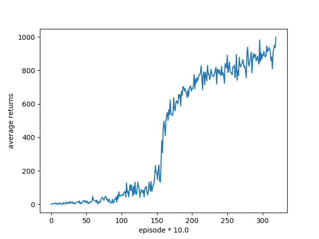

# rl_ddpg
## Purpose for this project 
demo for RL-DDPG, MADDPG algorithm  
## TO DO  
1. review articles   
2. brief knowledge for ROS, better simulation environment   
3. literature review(MARL non-stationary  problem)

## IN PROGRESS  
literature review  
review articles 

## DONE 
implement DDPG algorithm   
implement MADDPG algorithm 

## ENV 
openai/Multi-Agent Particle Environment/simple_tag  
introduction:  
* I train the agent on environment 'simple_tag' 
for 3000 episode.
* There are 4 agents in simple_tag, including 3 predators and 1 prey.
The work for us to do is using MADDPG to train predators to catch the prey.

## RESULT 
  
After training for 3000 episode we can get a high average return score. And it 
began to converge. 